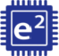
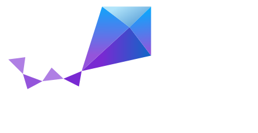

### Hi everyone 👋

My full name is `Dong Thanh Khoa`, but my friends often call me `Khoa Dong` .

- 🎓 I'm studying at HCM University of Technology.
- 🌱 I’m currently an **Embedded Software Engineer** at [Ban Vien Corporation](https://banvien.com).

<h4 align="left">Languages</h4>

<h4 align="left">Tools Management</h4>

<h4 align="left">Code Editor</h4>

<h4 align="left">IDE</h4>

<h4 align="left">Hardware Design</h4>

<h4 align="left">Network Tool</h4>

<a target="_blank" rel="noreferrer">

<a>

<h4 align="left">OS</h4>

<a target="_blank" rel="noreferrer">

<a>

